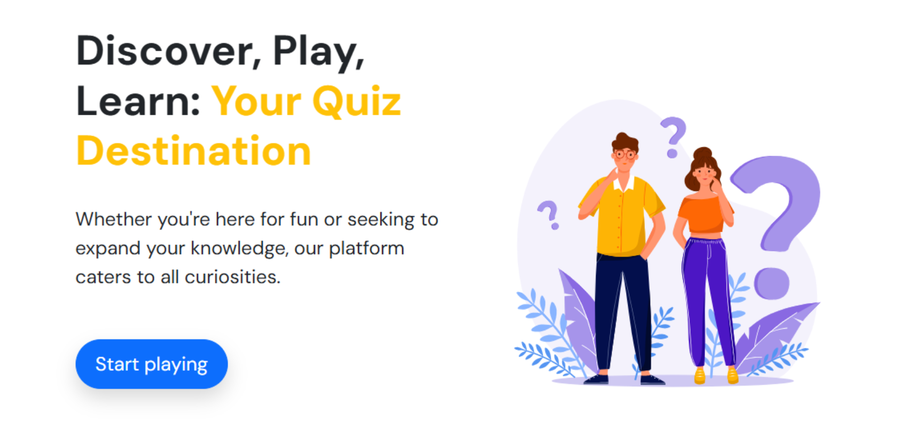

# I'm Not Human
In this project, we propose developing I’m Not Human, an educational app to teach users how to spot fake AI-generated content. This app will address the timely and growing challenge of distinguishing content created by humans from AI-generated text and media. With the rise of generative AI tools, misinformation, deepfakes, and propaganda are becoming increasingly difficult for the public to detect. The proposed software takes the form of an interactive game where players are presented with content and must decide whether or not they were created by an AI. Unlike existing quizzes, this project will focus heavily on detecting AI use from fake social media users. The intended audience is essentially anyone seeking to improve their AI literacy. This project provides users with a valuable tool to determine reality in an era where the line between human and machine is increasingly blurred.

This is an example screenshot of what the quiz app may look like.


# How to run
- Open your web browser (Chrome, Firefox, Safari, or Edge). 
- Go to the app URL: TBD
- On the homepage, click "Start"

# How to contribute
Follow this project board to know the latest status of the project: [http://...]([http://...])  

### How to build
- Fork this github repository
- Use branch dev-YOUR-NAME to make changes.  
- Necessary tools: Python 3.11.0, Flask, Node.js 22.15.0, React
- Additional dependencies will be installed via:
```
pip install -r requirements.txt
```
and 
```
npm install
```
